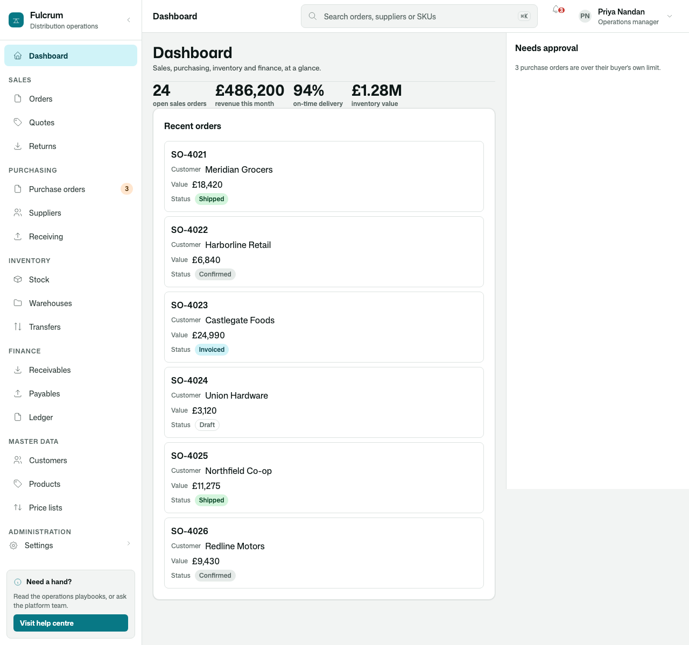
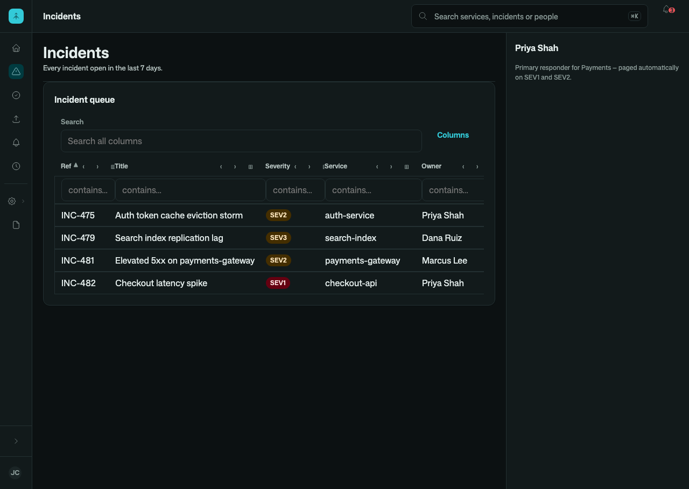

# Osysharp.Ui — the general application vocabulary for Osy# apps

## Use case

Every business app needs the same things before it needs anything of its own: buttons and fields that agree with each
other, dialogs and menus that trap focus and close on Escape, a data grid that sorts, filters and exports, settings
pages, empty and loading states — and a shell to hold it all: a sidebar or a rail, a top bar with search and a
command menu, a phone layout that turns the navigation into a drawer. This package is that vocabulary, written in
Osy# and themed by tokens, so an app re-skins it by declaring a `theme` rather than by restyling each control.





## Install and use

Every Osy# app has it in scope — the CLI ships it, so it resolves offline, with no `using` needed. Pin a major in
`app.osy` when you want a lock to name the version you built against:

```osy
app Fulcrum {
  use Osysharp.Ui@2;
  …
}
```

```osy
[Route("/orders")]
component Orders() {
  live var orders = Order.Where(o => o.Total >= 0);
  render {
    PageHead("Orders", subtitle: "Every open sales order.");
    DataGrid(
      rows: orders,
      label: "Orders",
      filterable: true,
      columns: [
        new GridColumn<Order> { Name = "Reference", Label = "Reference", Value = o => o.Reference },
        new GridColumn<Order> { Name = "Customer", Label = "Customer", Value = o => o.Customer },
        new GridColumn<Order> { Name = "Total", Label = "Total", Kind = GridColumnKind.Number,
                                Value = o => o.Total.ToString("N0"), Number = o => o.Total }
      ]);
  }
}
```

`osy kit` lists all of it with each control's arguments; `osy kit <Control>` prints one control's source, and
`osy kit shells` shows the arrangements a shell can take.

## What is in it

| group | controls |
|---|---|
| actions | `Button`, `IconButton`, `Menu`, `MenuItem`, `CommandMenu`, `KeyHint` |
| input | `Field`, `NumberField`, `DecimalField`, `DurationField`, `DatePicker`, `DateTimePicker`, `Dropdown`, `RadioGroup`, `Checkbox`, `Option`, `SearchField` |
| overlays | `Dialog`, `Backdrop`, `Scrim`, `ShellSheet`, `KeyboardSheet`, `AssistantPanel` |
| data | `DataGrid` (selectable, with a selection toolbar), `SelectionBar`, `FilterChip`, `Card`, `Metric`, `Badge`, `RecordBadge`, `RecordPanel`, `ListRow` |
| feedback | `Alert`, `Done`, `EmptyState`, `ProgressBar`, `Spinner`, `Skeleton`, `SaveBar`, `SaveActions`, `AutoSave`, `Lamp` |
| settings | `SettingsArea`, `SettingsPage`, `SettingsSection`, `SettingRow`, `SettingsOverview` |
| shells | `SidebarShell`, `RailShell`, `TabbedShell`, `WorkbenchShell`, `FocusedShell`, `SplitShell`, `CatalogueShell`, `EditorialShell`, `MarqueeShell`, `StorefrontShell` |
| page arrangements | `Dock` (right and bottom drawers), `SubNav`, `Paper`, `WidgetGrid`, `Widget` |
| typography | `PageHead`, `PageTitle`, `CardTitle`, `SectionLabel`, `FieldLabel`, `Hint`, `Strong` |

Its words are translated (`locales/`), and every control is keyboard-reachable and labelled for a screen reader.

## Source and package

- Source: one `.osy` file per group in this folder (`Button.osy`, `DataGrid.osy`, `Shell.Sidebar.osy`, …), the default
  theme in `theme.osy`.
- Tests: `tests/`.
- Package: `use Osysharp.Ui@2;` — the CLI carries the current release, and `osy lock` fetches any other from this
  repository's releases.

To build your own look on top of it, declare a `theme` in your app — its tokens re-skin every control. To change a
control itself, copy its file into your app or into a package of your own, rename the component, and use yours.
