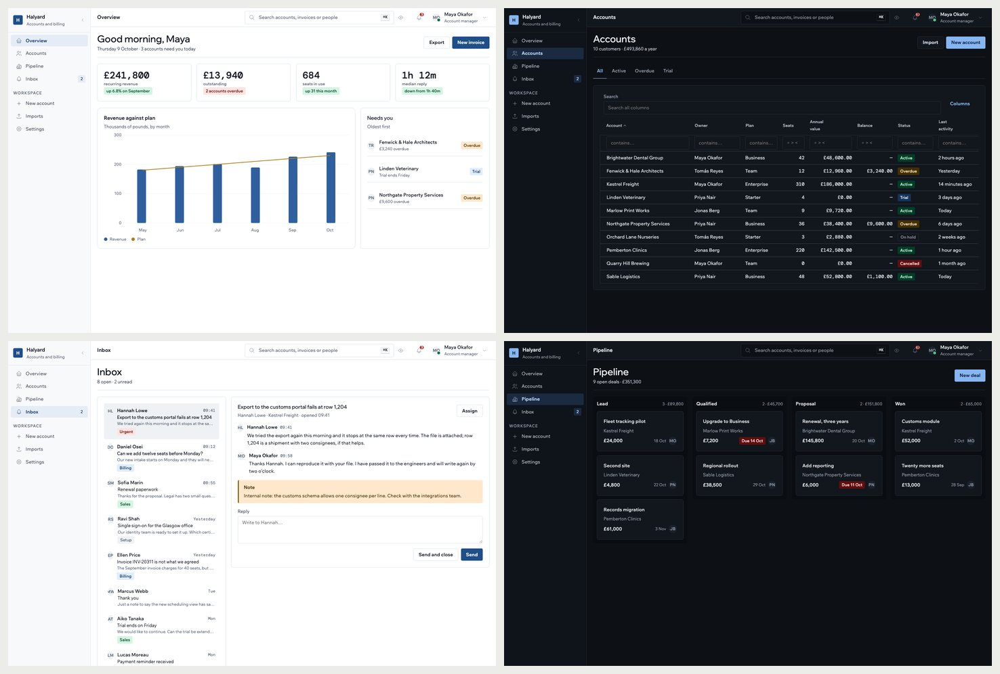
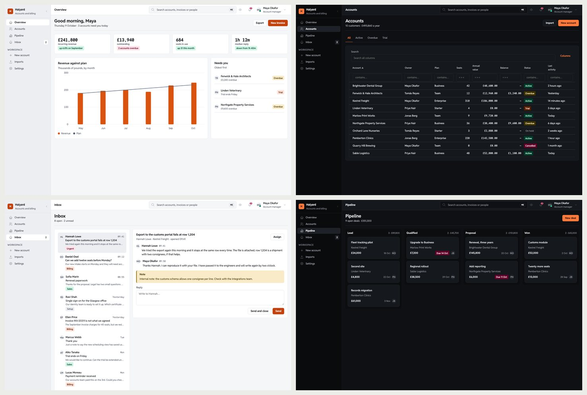
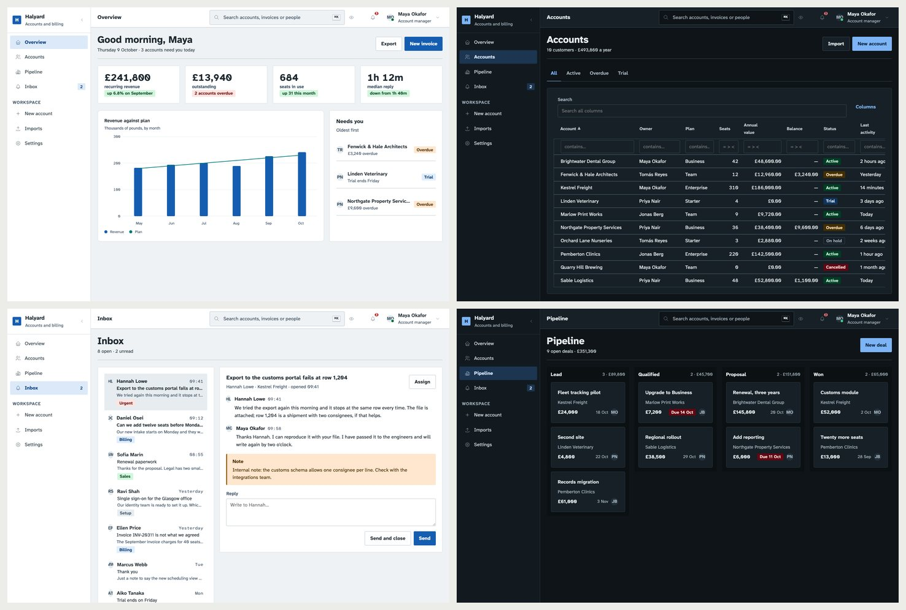
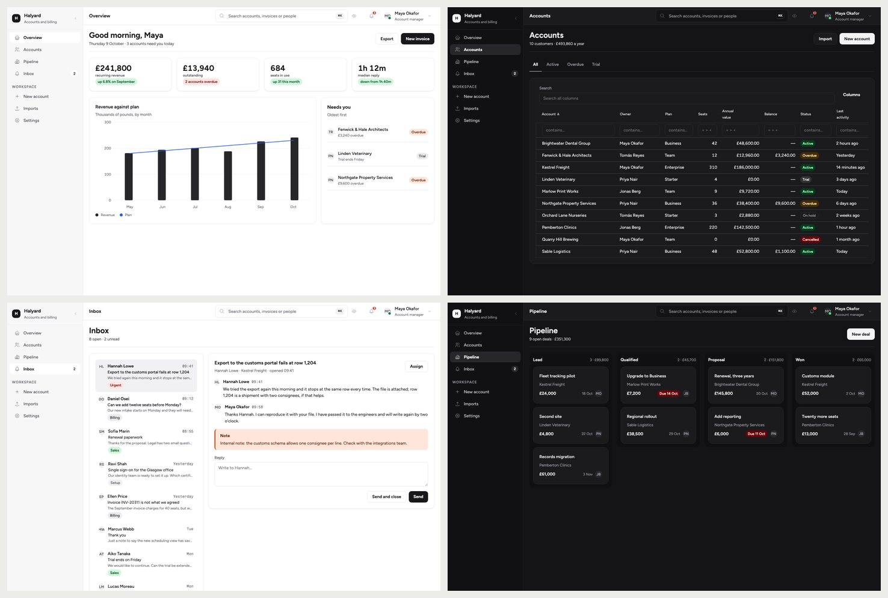
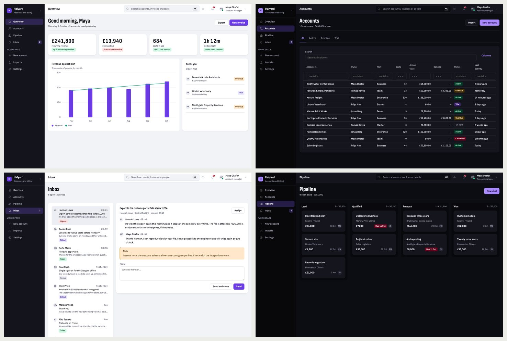
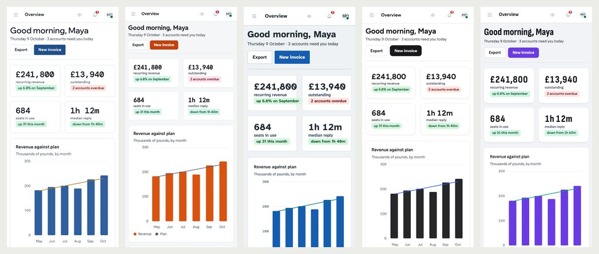

# Osysharp.Ui.Looks — five looks for business apps

Five finished designs for any app built on the UI kit. Each is a whole look — the palette in light and dark, the faces
it ships, the density, the corners, the elevation and the colours of the app's chrome — and each is a **base**: your
app derives from the closest one and makes it its own.

## Use case

You are building a business tool — a billing back office, a support desk, a booking system, a CRM, a reporting
dashboard — and it works, but it looks like every other app on the same kit. Pick the look that is closest to what the
app is for, try it on your own pages without changing a line, then derive from it and give it your brand's accent and
face. Everything you do not override stays as the look designed it, contrast-checked in both modes.

| look | for | |
|---|---|---|
| **Ledger** | finance, billing, accounting, procurement | white paper and hairline rules, headings at an ordinary weight, every figure in a mono that lines up, a Prussian-navy accent |
| **Relay** | support desks, operations, dispatch, developer tools | the densest look; graphite as good dark as light, a mono for every time and id, signal orange |
| **Civic** | healthcare, public services, anything anyone may have to use | large type in Atkinson Hyperlegible, controls you cannot miss, square corners, bold headings, a black focus ring |
| **Studio** | CRM, agencies, recruiting, project tools | Figtree, ink-black actions, soft grey chrome, round corners and pill tags, colour kept for people and states |
| **Signal** | analytics, reporting, dashboards, growth tools | an ink rail beside a light page, figures set tall in a condensed face, cards without an outline, ultraviolet |

### Ledger


### Relay


### Civic


### Studio


### Signal


…and on a phone, in the same order:



## Install

```osy
// app.osy
app Billing {
  use Osysharp.Ui;
  use Osysharp.Ui.Looks@0;
  model "model/**/*.osy";
}
```

```console
osy lock          # pins the package; its faces come with it
osy kit looks     # the five, with their faces, accents and density
```

## Using it

Try one on your own app first — nothing is written:

```console
osy compile --theme Looks.Relay
osy test --pixels --theme Looks.Civic     # every UI test photographed in Civic
```

Then derive from the closest and make it yours. Every token you do not override comes from the look:

```osy
using Osysharp.Ui.Looks;

theme Brand : Looks.Studio {
  Colors {
    Primary   = Modes.Of(light: Palette.From("#6B2D5C"), dark: Palette.From("#E7B8D9"));
    OnPrimary = Modes.Of(light: "#FFFFFF", dark: "#2A0F23");
  }
}
```

Change the accent first, then the display face, then the corners — and leave the rest: a look's surfaces, ink steps,
chrome and status colours were chosen together. Check that what you changed still reads, in a test that needs no
browser:

```osy
[Test]
void the_brand_still_reads() {
  Assert.Contrast("Colors.OnPrimary", "Colors.Primary");
  Assert.Contrast("Colors.Primary.Text", "Colors.Surface", mode: "dark");
}
```

The package's own `tests/contrast.test.osy` is the whole list of pairs the kit paints — copy it into your tests.

## What it does

| | |
|---|---|
| looks | five abstract themes — installing the package changes nothing until a theme derives from one |
| tokens | every look sets the same contract: the page's colours, action and states, the chrome (rail and bars), faces (text, display, mono, figures), the type scale and weights, corners, the density step, control heights and elevation, and the chart kit's first two series |
| faces | Wix Madefor, DM Mono, Reddit Sans and Mono, Atkinson Hyperlegible Next and Mono, Figtree, Fragment Mono, Sofia Sans and Sofia Sans Condensed, Spline Sans Mono — all under the SIL Open Font License, shipped in the package |
| checked | every words-on-ground pair at WCAG AA in light and dark (`tests/contrast.test.osy`); every accent clear of every status colour |
| specimen | `tests/` is a business app with one page per shape — an overview with a chart, a filtered table, a record, a board, an inbox, a form in every state, settings, empty states, a dialog and a toast — photographed in every look |

## Source

The looks are in `model/`, one file each; the faces and their licences in `fonts/`; the specimen in `tests/`.
Documentation: `osy docs ui-looks-kit`.

## Licence

MIT for the code. Each font keeps its own licence, beside it in `fonts/`.
